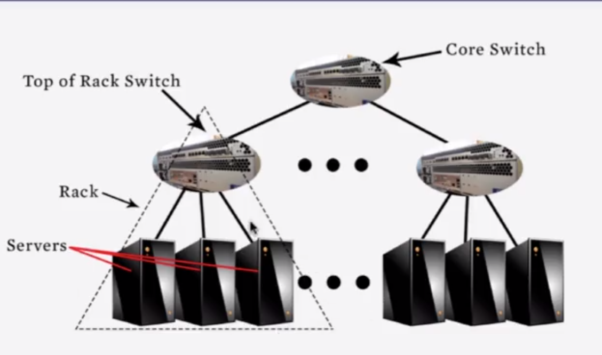
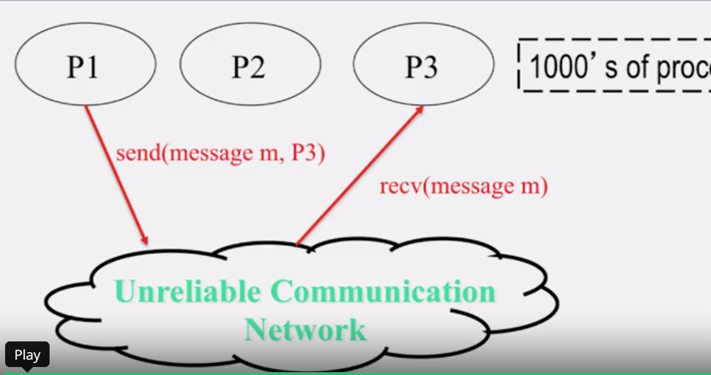

# Introduction to Clouds
---
## What is a cloud?

```
Cloud = Lots pf storage + compute cycles nearby
```

### Groups:
* single-site cloud a.k.a. Datacenter
* a geographically distributed cloud



### Major characteristics
1. Massive scale
   
   * large number of servers
2. On-demand access
3. Data-intensive Nature
4. New Cloud Programming Paradigms

    * MapReduce
    * Hadoop
    * storage engines
    * NoSQL
    * ...

### New Aspects of Clouds

On-demand: renting a cab vs (previously) renting a car or buying one

* Haas: Hardware as a Service
    * get access to barebones hardware machines
* IaaS: Infrastructure as a Service
    * get access to infrastructure of computing and storage. e.g., virtualization.
* Paas: Platform as a Service
    * get access to infrastructure coupled with a software platform.
* Saas: Software as a Service
    * get access to software services when you need them. e.g., Google docs

### Data-intensive Computing
* Computation-Intensive Computing
    * Typically run on supercomputers
* Data-Intensive
    * Typically store data at datacenters
    * Use compute nodes nearby
    * Compute nodes run computation services
  
    The focus is on *data*.

## A cloud IS a distributed system

> cloud is the latest nickname for distributed system

* A cloud consists of
  * hundreds to thousands of machines in a datacenter (server side)
  * thousands to millions of machines accessing these services (client side)

* Servers communicate amongst one another
* Clients communicate with servers
* Clients also communicate with each other

### Four features of Clouds = All Distributed Systems Features

1. Massive Scale
2. On-demand nature
   * access (multiple) servers anywhere
3. Data-intensive Nature
   * lots of data => need a cluster to store
4. New Cloud Programming Paradigms.
   * Hadoop/Mapreduce, NoSQL, all need clusters

### What is a distributed system?

#### What is an Operating System?

* User interface to hardware (device drivers)
* Provide abstractions (processes, file system)
* Resource manager (scheduler)
* Means of communication (networking)

#### What is a distributed system?

* A distributed system is a collection of independent computers that appear to the users of the system as a single computer.
* Three primary characteristics:
  * multiple computers
  * interconnections
  * shared state

> distributed system = many processes sending and receiving messages




### MapReduce Paradigm

    (map square(1 2 3 4))
     Output   (1 4 9 16)
     //processes each record sequentially and independently

     (reduce + (1 4 9 16))
        (+ 16(+9(+4 1)))
        Output 30

Map: process individual records to generate intermediate key/value pairs.


Reduce: processes and merges all intermediate values associated per key

